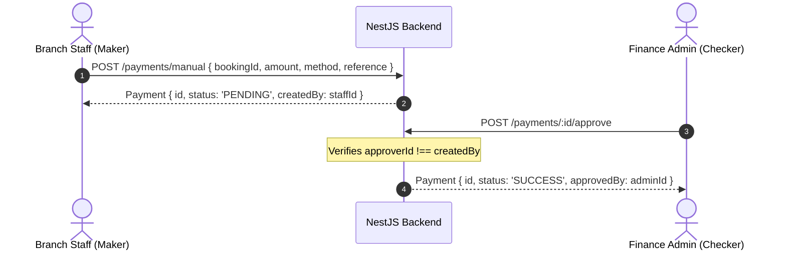

# Admin Frontend Integration Guide
**Hajj & Umrah Booking System — Executive & Operations Admin Portal**

This document serves as the complete technical integration guide for building the **Admin/Operations Frontend** application, grounded directly in the live NestJS backend OpenAPI specification (`https://hajj-umrah-backend.vercel.app/api/docs-json`).

---

## 1. Backend Environment & Base URLs

| Environment | Base API URL | Swagger Documentation |
| :--- | :--- | :--- |
| **Production (Vercel)** | `https://hajj-umrah-backend.vercel.app/api/v1` | `https://hajj-umrah-backend.vercel.app/api/docs` |
| **Local Development** | `http://localhost:3001/api/v1` | `http://localhost:3001/api/docs` |

> [!IMPORTANT]
> - All Admin endpoints require `Authorization: Bearer <access_token>` with a user having `role === 'ADMIN'`.
> - State-mutating operations (**approvals**, **refunds**, **reconciliations**) should supply an `Idempotency-Key: <uuid-v4>` header.

---

## 2. API Response Wrapper & Error Handling

### Standard Success Wrapper
```typescript
interface ApiResponse<T> {
  data: T;
  message: string;
}
```

### Standard Error Wrapper
```typescript
interface ApiError {
  statusCode: number;
  message: string | string[];
  error?: string;
  code?: string;
}
```

---

## 3. Core Admin Modules & Endpoint Specifications

### 3.1. Package & Tier Management

#### 1. List All Packages (Admin)
- **Endpoint**: `GET /api/v1/admin/packages`
- **Query Params**: `page=1&limit=20&status=DRAFT|PUBLISHED|ARCHIVED`
- **Response `200 OK`**:
```typescript
interface AdminPackage {
  id: string;
  name: string;
  type: 'HAJJ' | 'RAMADAN_UMRAH' | 'OFF_SEASON_UMRAH' | 'ZIYARAH';
  description: string;
  departureDate: string;
  bookingStartDate: string;
  bookingEndDate: string;
  status: 'DRAFT' | 'PUBLISHED' | 'ARCHIVED';
  version: number;
  tiers: AdminPackageTier[];
}
```

#### 2. Create Package
- **Endpoint**: `POST /api/v1/admin/packages`
- **Request Body**:
```typescript
interface CreatePackageDto {
  name: string;
  type: 'HAJJ' | 'RAMADAN_UMRAH' | 'OFF_SEASON_UMRAH' | 'ZIYARAH';
  description: string;
  departureDate: string;     // YYYY-MM-DD
  bookingStartDate: string;  // YYYY-MM-DD
  bookingEndDate: string;    // YYYY-MM-DD
}
```

#### 3. Update Package (Optimistic Locking)
- **Endpoint**: `PATCH /api/v1/admin/packages/:id`
- **Request Body**:
```typescript
interface UpdatePackageDto {
  name?: string;
  description?: string;
  departureDate?: string;
  bookingEndDate?: string;
  version: number; // Required for optimistic concurrency (returns 409 on conflict)
}
```

#### 4. Publish / Archive Package
- **Publish**: `PATCH /api/v1/admin/packages/:id/publish`
- **Archive**: `PATCH /api/v1/admin/packages/:id/archive`

#### 5. Create Tier for Package
- **Endpoint**: `POST /api/v1/admin/packages/:packageId/tiers`
- **Request Body**:
```typescript
interface CreateTierDto {
  name: string;    // e.g. "VIP Platinum", "Standard", "Economy"
  price: number;   // Unit price in BDT (e.g. 350000)
  quota: number;   // Maximum seats available (e.g. 50)
}
```

#### 6. Update Tier
- **Endpoint**: `PATCH /api/v1/admin/tiers/:id`
- **Request Body**:
```typescript
interface UpdateTierDto {
  name?: string;
  price?: number;
  quota?: number;  // Cannot be lower than confirmedSeats
  version?: number;
}
```

---

### 3.2. Manual Payments & Dual Control (Maker-Checker)

Branch payments must comply with dual control: the staff who recorded the payment cannot be the staff who approves it (`recorded_by !== approved_by`).



#### 1. Record Manual Payment (Maker)
- **Endpoint**: `POST /api/v1/payments/manual`
- **Request Body**:
```typescript
interface CreateManualPaymentDto {
  bookingId: string;
  amount: number;
  method: 'CASH' | 'BANK_TRANSFER' | 'CHEQUE';
  reference?: string;
}
```

#### 2. Approve Manual Payment (Checker)
- **Endpoint**: `POST /api/v1/payments/:id/approve`
- **Rule**: Current authenticated Admin ID must NOT match `createdBy`. Returns `403 Forbidden` on self-approval.

#### 3. Reject Manual Payment
- **Endpoint**: `POST /api/v1/payments/:id/reject`
- **Request Body**: `{ "reason": "Invalid transaction reference" }`

---

### 3.3. Cancellations & Refund Processing

#### 1. Approve / Reject Cancellation Request
- **Approve**: `POST /api/v1/cancellations/:id/approve`
- **Reject**: `POST /api/v1/cancellations/:id/reject`
- **Request Body**: `{ "reason": "Approved with 10% cancellation fee" }`

#### 2. Process Refund Lifecycle
- **Endpoint**: `POST /api/v1/refunds/:id/process`
- **Rule**: Refund amount cannot exceed total received payments.

---

### 3.4. Gateway Reconciliation & Discrepancies

Automated comparison between internal ledger payments and payment gateway settlement batches.

#### 1. Upload Gateway Settlement Batch
- **Endpoint**: `POST /api/v1/reconciliation/batch`
- **Request Body**:
```typescript
interface ReconcileBatchDto {
  provider: 'BKASH' | 'NAGAD' | 'SSLCOMMERZ' | 'STRIPE';
  settlementDate: string;
  transactions: Array<{
    gatewayTransactionId: string;
    amount: number;
    fee?: number;
    status: 'SETTLED' | 'REFUNDED';
  }>;
}
```

#### 2. Get Unresolved Discrepancies
- **Endpoint**: `GET /api/v1/reconciliation/discrepancies`
- **Response**: List of mismatched records (`status: 'MISMATCH' | 'UNDER_REVIEW'`).

#### 3. Update Dispute Status
- **Endpoint**: `PATCH /api/v1/reconciliation/:id/status`
- **Request Body**: `{ "status": "RESOLVED", "resolutionNotes": "Bank fee adjusted" }`

---

### 3.5. Multi-Currency Vendor Expenses

Tracks expenses in Saudi Riyal (SAR) and Bangladeshi Taka (BDT) with currency conversion rates.

#### 1. Create Vendor
- **Endpoint**: `POST /api/v1/vendors`
- **Request Body**: `{ "name": "Al Safwah Hotel Makkah", "currency": "SAR", "category": "HOTEL" }`

#### 2. Record Vendor Expense
- **Endpoint**: `POST /api/v1/vendors/expenses`
- **Request Body**:
```typescript
interface CreateVendorExpenseDto {
  vendorId: string;
  bookingId?: string;
  packageId?: string;
  amount: number;          // In vendor currency (e.g. 10000 SAR)
  currency: 'SAR' | 'BDT' | 'USD';
  exchangeRate: number;    // e.g. 32.10
  amountBdt: number;       // Calculated: amount * exchangeRate
  description: string;
}
```

#### 3. Net Margin & Financial Summary
- **Endpoint**: `GET /api/v1/vendors/expenses/financial-summary`
- **Response**:
```json
{
  "data": {
    "totalRevenueBdt": 45000000,
    "totalExpensesBdt": 32100000,
    "netMarginBdt": 12900000,
    "profitMarginPercentage": 28.67
  }
}
```

---

### 3.6. Pilgrim Inventory Management

Tracks physical goods issued to pilgrims (Ihram, luggage bags, SIM cards).

#### 1. Create Item
- **Endpoint**: `POST /api/v1/inventory/items`
- **Request Body**: `{ "name": "Premium Cotton Ihram Set", "sku": "IHR-001", "quantity": 500, "unitCost": 1500 }`

#### 2. Record Stock Transaction
- **Endpoint**: `POST /api/v1/inventory/transactions`
- **Request Body**:
```typescript
interface InventoryTransactionDto {
  itemId: string;
  bookingId?: string; // If issuing to a specific booking
  type: 'PURCHASE' | 'ISSUE' | 'RETURN' | 'ADJUSTMENT';
  quantity: number;
  notes?: string;
}
```

---

### 3.7. Audit Mutation Trail

Every state-changing admin action produces an immutable audit entry.

#### 1. List Audit Logs
- **Endpoint**: `GET /api/v1/audit-logs`
- **Query Params**: `page=1&limit=50&entityType=Package|Booking|Payment|Refund`
- **Response**:
```typescript
interface AuditLog {
  id: string;
  actorId: string;
  actorEmail?: string;
  action: string;          // e.g. "APPROVE_PAYMENT", "UPDATE_QUOTA"
  entityType: string;      // e.g. "Payment", "PackageTier"
  entityId: string;
  oldValue: Record<string, any>;
  newValue: Record<string, any>;
  ipAddress?: string;
  createdAt: string;
}
```

---

### 3.8. Executive Analytics & Reports

#### 1. Bookings Executive Summary
- **Endpoint**: `GET /api/v1/reports/bookings`
- **Data**: Total bookings, Confirmed, Pending, Cancelled, and revenue trends.

#### 2. Collections & Cashflow Report
- **Endpoint**: `GET /api/v1/reports/collections`
- **Data**: Total collections by provider (bKash, Nagad, Cards, Manual).

#### 3. Outstanding & Overdue Installments
- **Endpoint**: `GET /api/v1/reports/outstanding-installments`
- **Data**: Aging reports, overdue counts, upcoming installment maturities.

#### 4. Seat Quota & Occupancy Report
- **Endpoint**: `GET /api/v1/reports/seats`
- **Data**: Capacity utilization, total quota, confirmed seats, held seats.

---

## 4. Admin Frontend Architecture Guidelines

1. **Role Guard**: Ensure routes check `user.role === 'ADMIN'`. Redirect unauthorized pilgrims to `/packages`.
2. **Optimistic Locking Guard**: When submitting `PATCH /admin/packages/:id` or `/admin/tiers/:id`, include the latest `version` property. Display a conflict refresh banner on `409 CONFLICT`.
3. **Dual Control Toast Feedback**: Block approval buttons when `payment.createdBy === currentAdmin.id` with a tooltip: *"Dual control rule: You cannot approve a payment you recorded."*
