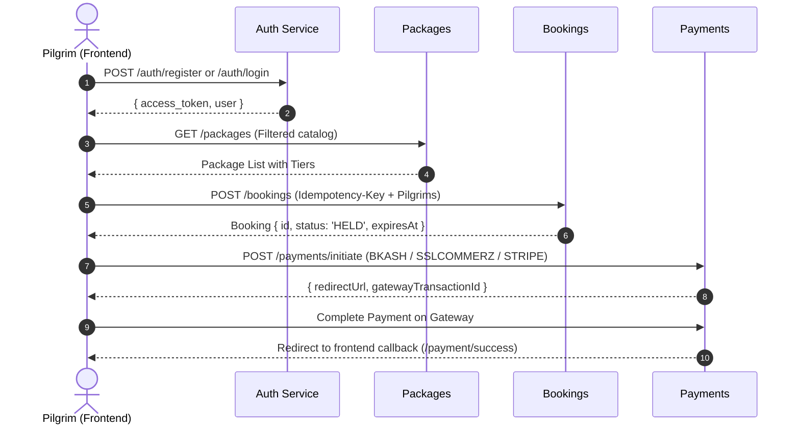

# Client-Side Frontend Integration Guide
**Hajj & Umrah Booking System — Pilgrim Web & Mobile Portal**

This document serves as the complete technical integration guide for building the **Client-Side (Pilgrim/Public)** frontend application.

---

## 1. Backend Environment & Base URLs

| Environment | Base API URL | Swagger Documentation |
| :--- | :--- | :--- |
| **Production (Vercel)** | `https://hajj-umrah-backend.vercel.app/api/v1` | `https://hajj-umrah-backend.vercel.app/api/docs` |
| **Local Development** | `http://localhost:3001/api/v1` | `http://localhost:3001/api/docs` |

> [!IMPORTANT]
> All standard endpoints are prefixed with `/api/v1`. All protected user requests MUST include the JWT token in the `Authorization` header: `Bearer <access_token>`.

---

## 2. API Conventions & Standards

### Standard Success Response
Every successful API response follows this wrapper structure:
```typescript
interface ApiResponse<T> {
  data: T;
  message: string;
}
```

### Standard Error Response
```typescript
interface ApiError {
  statusCode: number;
  message: string | string[];
  error?: string;
  code?: string;
}
```

### Idempotency Header
For critical operations (**booking creation**, **payment initiation**, **cancellation requests**), supply a unique UUID v4 in the request header to prevent duplicate charges or seat holds on network retries:
```http
Idempotency-Key: 9b1deb4d-3b7d-4bad-9bdd-2b0d7b3dcb6d
```

---

## 3. Core Pilgrim Workflows & Endpoints



---

## 4. Detailed API Specifications for Client Frontend

### 4.1. Authentication & Profile

#### 1. Register
- **Endpoint**: `POST /auth/register`
- **Access**: Public
- **Request Body**:
```typescript
interface RegisterDto {
  name: string;          // e.g. "Ahmed Khan"
  email: string;         // e.g. "ahmed@example.com"
  password: string;      // min 8 characters
  phone?: string;        // e.g. "+8801700000000"
}
```
- **Response `201 Created`**:
```json
{
  "data": {
    "access_token": "eyJhbGciOi...",
    "user": {
      "id": "uuid-here",
      "name": "Ahmed Khan",
      "email": "ahmed@example.com",
      "role": "USER",
      "status": "ACTIVE"
    }
  },
  "message": "Registration successful"
}
```

#### 2. Login
- **Endpoint**: `POST /auth/login`
- **Access**: Public
- **Request Body**:
```typescript
interface LoginDto {
  email: string;
  password: string;
}
```
- **Response `200 OK`**: Same token structure as register.

#### 3. Get Current Profile
- **Endpoint**: `GET /auth/me`
- **Headers**: `Authorization: Bearer <token>`
- **Response `200 OK`**:
```json
{
  "data": {
    "id": "uuid-here",
    "name": "Ahmed Khan",
    "email": "ahmed@example.com",
    "phone": "+8801700000000",
    "role": "USER",
    "status": "ACTIVE"
  },
  "message": "Success"
}
```

---

### 4.2. Package Discovery & Details

#### 1. Browse Published Packages
- **Endpoint**: `GET /packages`
- **Access**: Public
- **Query Parameters**:
  - `type` (optional): Filter by `HAJJ` or `UMRAH`
  - `minPrice` / `maxPrice` (optional): Filter price range in BDT
  - `departureDate` (optional): `YYYY-MM-DD`
- **Response `200 OK`**:
```json
{
  "data": [
    {
      "id": "package-uuid",
      "name": "Premium Umrah Package - Ramadan 2026",
      "type": "UMRAH",
      "description": "5-star hotel near Haram, direct flights.",
      "departureDate": "2026-03-15",
      "bookingStartDate": "2026-01-01",
      "bookingEndDate": "2026-03-01",
      "status": "PUBLISHED",
      "tiers": [
        {
          "id": "tier-uuid-1",
          "name": "VIP Platinum",
          "price": 350000,
          "quota": 50,
          "heldSeats": 5,
          "confirmedSeats": 30,
          "availableSeats": 15
        },
        {
          "id": "tier-uuid-2",
          "name": "Economy Gold",
          "price": 220000,
          "quota": 100,
          "heldSeats": 10,
          "confirmedSeats": 70,
          "availableSeats": 20
        }
      ]
    }
  ],
  "message": "Success"
}
```

#### 2. Get Single Package Details
- **Endpoint**: `GET /packages/:id`
- **Access**: Public

---

### 4.3. Booking Creation & Management

#### 1. Create Booking (Hold Seats & Price Freeze)
- **Endpoint**: `POST /bookings`
- **Headers**: 
  - `Authorization: Bearer <token>`
  - `Idempotency-Key: <unique-uuid>` *(Recommended)*
- **Request Body**:
```typescript
interface CreateBookingDto {
  packageId: string;
  tierId: string;
  paymentMode: 'FULL' | 'INSTALLMENT';
  pilgrims: Array<{
    fullName: string;
    passportNumber: string;
    nationality?: string;
    dateOfBirth?: string;    // YYYY-MM-DD
    passportExpiry?: string; // YYYY-MM-DD
  }>;
}
```
- **Response `201 Created`**:
```json
{
  "data": {
    "id": "booking-uuid",
    "userId": "user-uuid",
    "packageId": "package-uuid",
    "tierId": "tier-uuid",
    "status": "HELD",
    "paymentMode": "FULL",
    "tierNameSnapshot": "VIP Platinum",
    "unitPriceSnapshot": 350000,
    "totalAmount": 700000,
    "expiresAt": "2026-09-23T11:45:00.000Z",
    "pilgrims": [
      {
        "id": "pilgrim-uuid-1",
        "fullName": "Ahmed Khan",
        "passportNumber": "A12345678",
        "status": "ACTIVE"
      }
    ]
  },
  "message": "Booking created successfully"
}
```

> [!NOTE]
> Created bookings start in `HELD` status with an expiration timer (`expiresAt`, default 30-60 mins). Frontend should show a countdown timer for completing payment.

#### 2. Get My Bookings
- **Endpoint**: `GET /bookings`
- **Headers**: `Authorization: Bearer <token>`
- **Response `200 OK`**: Returns all bookings owned by the authenticated user.

#### 3. Get Single Booking by ID
- **Endpoint**: `GET /bookings/:id`
- **Headers**: `Authorization: Bearer <token>`
- **Behavior**: Returns full details with pilgrims, seat holds, and payment history. User can only view their own bookings.

---

### 4.4. Installment Schedule & Tracking

#### 1. View Installments for a Booking
- **Endpoint**: `GET /installments/booking/:bookingId`
- **Headers**: `Authorization: Bearer <token>`
- **Response `200 OK`**:
```json
{
  "data": [
    {
      "id": "installment-uuid-1",
      "bookingId": "booking-uuid",
      "sequence": 1,
      "amountDue": 200000,
      "amountPaid": 200000,
      "dueDate": "2026-04-01",
      "status": "PAID"
    },
    {
      "id": "installment-uuid-2",
      "bookingId": "booking-uuid",
      "sequence": 2,
      "amountDue": 250000,
      "amountPaid": 0,
      "dueDate": "2026-05-01",
      "graceEndDate": "2026-05-07",
      "status": "PENDING"
    }
  ],
  "message": "Success"
}
```

---

### 4.5. Payments & Online Checkout

#### 1. Initiate Online Payment
- **Endpoint**: `POST /payments/initiate`
- **Headers**: `Authorization: Bearer <token>`
- **Request Body**:
```typescript
interface InitiatePaymentDto {
  bookingId: string;
  amount: number;                                // In BDT
  provider: 'BKASH' | 'NAGAD' | 'SSLCOMMERZ' | 'STRIPE';
  method?: string;                               // e.g. "CARD", "WALLET"
}
```
- **Response `200 OK`**:
```json
{
  "data": {
    "paymentId": "payment-uuid",
    "gatewayTransactionId": "TRX-BKASH-987654",
    "redirectUrl": "https://sandbox.payment-gateway.com/checkout?session=...",
    "amount": 200000,
    "currency": "BDT"
  },
  "message": "Payment session initiated"
}
```
*Frontend Action: Redirect the pilgrim to `redirectUrl`.*

---

### 4.6. Cancellation & Refund Requests

#### 1. Request Full Booking Cancellation
- **Endpoint**: `POST /cancellations/request`
- **Headers**: `Authorization: Bearer <token>`
- **Request Body**:
```typescript
interface RequestCancellationDto {
  bookingId: string;
  reason: string;
}
```
- **Response `201 Created`**:
```json
{
  "data": {
    "id": "cancellation-uuid",
    "bookingId": "booking-uuid",
    "status": "REQUESTED",
    "cancellationFee": 10000
  },
  "message": "Cancellation request submitted"
}
```

#### 2. Request Partial Pilgrim Cancellation
- **Endpoint**: `POST /cancellations/request/pilgrim`
- **Headers**: `Authorization: Bearer <token>`
- **Request Body**:
```typescript
interface RequestPilgrimCancellationDto {
  bookingId: string;
  pilgrimId: string;
  reason: string;
}
```

---

## 5. Client Frontend State & Storage Recommendations

1. **Authentication Token**: Store `access_token` in HTTP-only Cookies or Secure LocalStorage.
2. **Axios / Fetch Interceptor**:
```typescript
import axios from 'axios';

export const apiClient = axios.create({
  baseURL: process.env.NEXT_PUBLIC_API_URL || 'https://hajj-umrah-backend.vercel.app/api/v1',
  headers: {
    'Content-Type': 'application/json',
  },
});

apiClient.interceptors.request.use((config) => {
  const token = localStorage.getItem('token');
  if (token) {
    config.headers.Authorization = `Bearer ${token}`;
  }
  return config;
});
```
